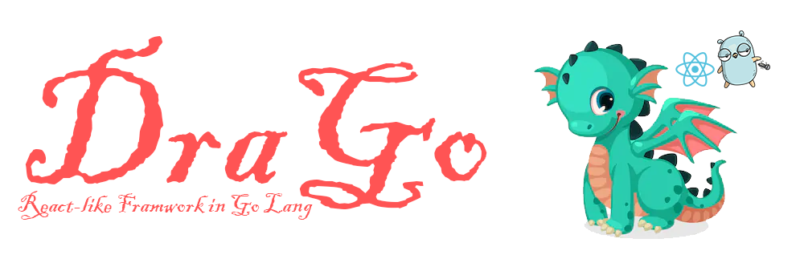

# DraGo, React for Go

DraGo is a react-like framework for developer to make apps and website in pure Go.
it supports only functional componennts (Go doesn't have classes) and provide hooks too (useState).

# Installation

using GuPM, first, install the drago provider which allow you to bootstrap projects easily.

```bash
g plugin install https://azukaar.github.io/DraGo/repo:provider-drago
```

Then get started: 

```bash
g b -p drago # bootstrap
g make
g build
g start webkit # start app
g start browser # start web
```

# Example component

```go
package components

import (
  h "github.com/azukaar/drago"
)

func ToggleButton(document *h.DocumentObject) func() h.Node {
  toggled, setToggled := document.UseToggle(true)

  return func() h.Node {
    return h.Div(h.Props{},
      h.Text("Toggle me"),
      h.Button(h.Props{"onclick": setToggled},
        h.If(toggled(),
          h.Text("on"),
          h.Text("off"),
        ),
      ),
    )
  }
}

```